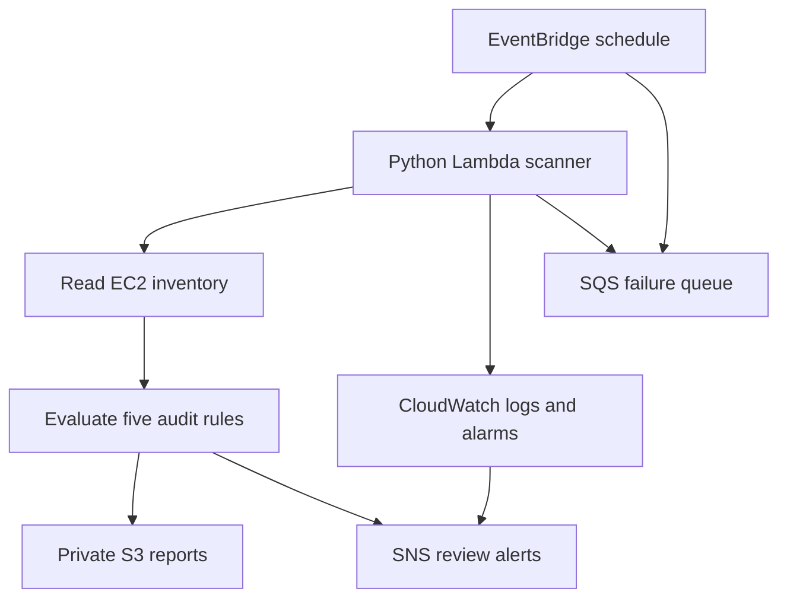

# CloudScope

**Read-only AWS resource auditing with serverless delivery, Terraform and CI/CD.**

Cloud resources can remain allocated after experiments finish, lose ownership information, or retain permissive access rules. CloudScope turns a small set of EC2 inventory APIs into an evidence-based review report. It is a focused portfolio implementation for a single AWS account, not a full security scanner or a billing prediction engine.

Start with [START_HERE.md](START_HERE.md). A ready-to-open, fully synthetic report is at [examples/demo-report/report.html](examples/demo-report/report.html).

## Architecture



Terraform provisions the AWS resources. The scheduler starts disabled. The local CLI and scheduled function share the same rules and report generator. The scanner uses no NAT Gateway, EC2 instance, public web endpoint or always-running server.

## Audit rules

| Rule | Priority | Evidence | Limit |
|---|---|---|---|
| `EBS_UNATTACHED` | Medium | Volume state is `available`, with no attachments | Does not establish how long it has been detached or whether it is intentionally retained |
| `EIP_UNASSOCIATED` | Medium | No association ID or network interface | Reserved IPs may be intentional; billing exceptions can apply |
| `EBS_UNENCRYPTED` | Medium | `Encrypted=false` | Detects configuration only; no migration is performed |
| `SG_PUBLIC_ADMIN` | High | TCP 22 or 3389 allowed from `0.0.0.0/0` or `::/0`, including all-protocol rules | Does not inspect attachments, routes, NACLs or effective internet reachability |
| `REQUIRED_TAGS` | Low | Missing/blank `Owner`, `Environment` or `Project` on EC2/EBS | Case-sensitive; terminated/shutting-down instances are excluded |

The public-administration rule detects explicit universal CIDRs, not every possible combination of CIDRs that collectively covers the internet. Priorities are project review priorities, not CVSS scores. Findings are recommendations for investigation, never deletion instructions or measured cost savings.

## Local demo

Requires Python 3.12+. No packages or credentials are needed for demo mode.

```bash
python -m cloudscope demo --out reports
```

Open `reports/report.html`. JSON includes the scan status, resource counts, findings and collection errors. CSV contains findings only; always read the JSON/HTML status before interpreting an empty CSV as a clean result.

Expected sample output: **11 resources; 7 findings: 1 high, 4 medium, 2 low**.

## Scan an account

Install the pinned SDK set, configure an AWS profile with the inventory permissions in `examples/scanner-policy.json`, then authenticate using your normal AWS CLI/SSO process. Adjust the policy's allowed regions when scanning more than Mumbai.

```bash
python -m pip install -r requirements.lock
aws sts get-caller-identity --profile cloudscope
python -m cloudscope scan --profile cloudscope --regions ap-south-1 --out reports/live
```

The AWS identity check is required before inventory collection. No persistent AWS keys are embedded in this project. The application uses Boto3's normal credential chain.

Useful options:

```bash
python -m cloudscope scan --regions ap-south-1 ap-southeast-1 --required-tags Owner Environment Project --out reports/live
python -m cloudscope scan --regions ap-south-1 --fail-on high --out reports/live
```

| Exit code | Meaning |
|---|---|
| `0` | Complete scan, and no configured finding threshold was exceeded |
| `1` | Complete scan with findings at/above `--fail-on` |
| `2` | Collection or execution failure; inspect the partial report if one was written |

Without `--fail-on`, findings do not make a complete scan fail. The CLI overwrites `report.html`, `report.json` and `report.csv` in the selected output folder.

## Docker

```bash
docker build -t cloudscope:local .
docker run --name cloudscope-demo cloudscope:local
docker cp cloudscope-demo:/reports ./docker-reports
docker rm cloudscope-demo
```

Open `docker-reports/report.html`. The container runs as UID 10001. Credentials are not copied into the image. For a live container scan, arrange short-lived credentials via your own container runtime; the default container command is the offline demo. Build validation is provided in GitHub Actions and was not run locally here.

## Infrastructure and delivery

See [docs/DEPLOYMENT.md](docs/DEPLOYMENT.md) for the initial Terraform deployment, a manual Lambda test, report retrieval, schedule activation, cleanup and optional OIDC-based code delivery.

The CI workflow tests the scanner, builds a dependency-complete Lambda ZIP, validates Terraform and smoke-tests Docker. The separate CD workflow runs only when manually dispatched on `main`, targets an existing Lambda and uses GitHub OIDC. It does not provision infrastructure. Configure its GitHub environment and AWS role first.

## Project layout

| Path | Purpose |
|---|---|
| `cloudscope/audit.py` | Pure rules and stable finding identifiers |
| `cloudscope/collector.py` | AWS reads, pagination, bounded SDK retries and error collection |
| `cloudscope/report.py` | Escaped HTML, spreadsheet-safe CSV and JSON output |
| `cloudscope/handler.py` | Scheduled AWS entry point and alerts |
| `infra/` | Terraform configuration |
| `tests/` | Local tests and real SDK response contracts using Stubber |
| `scripts/build_lambda.py` | Rebuilds the deployment ZIP |
| `examples/` | Sample IAM policies and synthetic demo reports |
| `.github/workflows/` | CI and optional manual code deployment |
| `docs/` | Setup, demo, limitations and validation |

## Design boundaries

- Single account; explicit regions, not automatic organization-wide discovery. Terraform limits the Lambda to one to three regions, but very large inventories can still exceed its five-minute timeout.
- Uses EC2 Describe APIs only for inventory. The Lambda additionally writes reports/logs and publishes alerts. It has no stop, delete, modify or release permissions for scanned resources.
- Every paginated operation collects all pages. If a later page fails, earlier data is kept and the scan is marked partial. A partial scheduled scan saves reports and raises an error so monitoring can detect it.
- HTML uses escaped data and no external fonts/scripts. CSV protects leading spreadsheet-formula characters. Live reports still contain account/resource information and should remain private.
- Notifications are sent for high-priority findings and partial scans. Medium/low-only findings are available in the report. There is no finding suppression, alert deduplication or resolved-finding tracking yet; retries may send duplicate notifications.
- S3 blocks public access, requires TLS and uses SSE-S3 encryption. Report objects expire after 30 days; noncurrent versions expire after seven days. Lifecycle removal is asynchronous.
- No AWS price API or utilization history is queried. Unused-resource findings are investigation candidates, not a savings total.

## Development

```bash
python -m pip install -r requirements.lock
python -m unittest discover -s tests -v
python scripts/build_lambda.py
```

The pinned dependency file records the SDK set tested for this build. Update it together with `pyproject.toml`, then rerun tests and rebuild. It is not a hash-verified supply-chain lock. Terraform's provider lock file should be generated by `terraform init` and committed; it is absent from this offline initial package.

See [docs/VALIDATION.md](docs/VALIDATION.md) for current evidence. Suggested extensions: approved finding suppressions with expiry dates, DynamoDB finding history, separate per-region Lambda jobs, organization account discovery, and utilization-aware review rules.

## Official references

- [Boto3 EC2 API](https://docs.aws.amazon.com/boto3/latest/reference/services/ec2.html)
- [DescribeVolumes pagination](https://docs.aws.amazon.com/boto3/latest/reference/services/ec2/paginator/DescribeVolumes.html)
- [Lambda Python deployment packages](https://docs.aws.amazon.com/lambda/latest/dg/python-package.html)
- [Lambda asynchronous retry behavior](https://docs.aws.amazon.com/lambda/latest/dg/invocation-async-error-handling.html)
- [Terraform AWS Lambda resource](https://registry.terraform.io/providers/hashicorp/aws/latest/docs/resources/lambda_function)
- [CloudWatch alarm notification permissions](https://docs.aws.amazon.com/AmazonCloudWatch/latest/monitoring/Notify_Users_Alarm_Changes.html)
- [AWS credentials action and OIDC setup](https://github.com/aws-actions/configure-aws-credentials)

This project is not affiliated with AWS. Screenshots, findings and totals in the supplied demo are synthetic.
